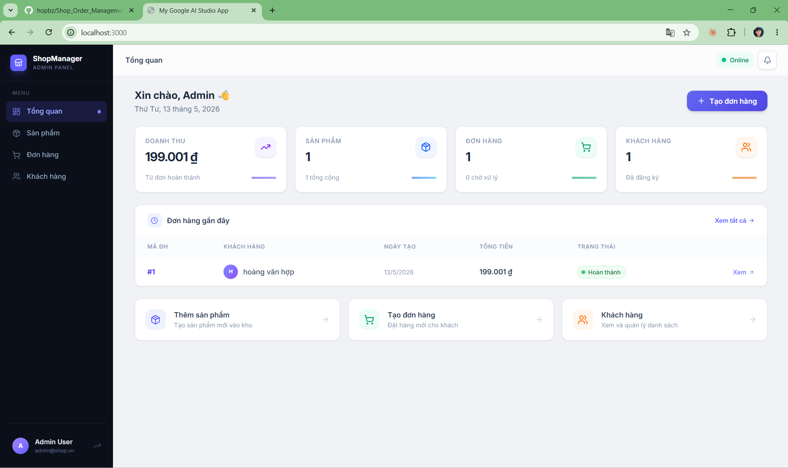
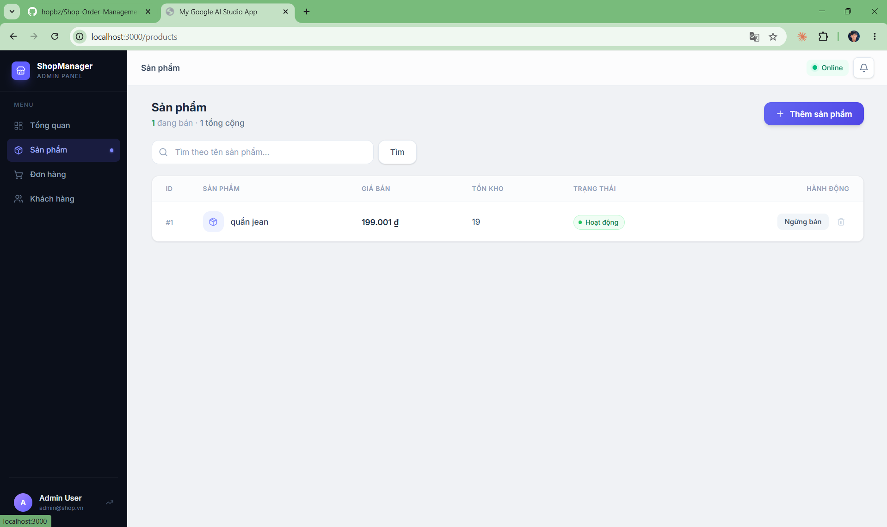
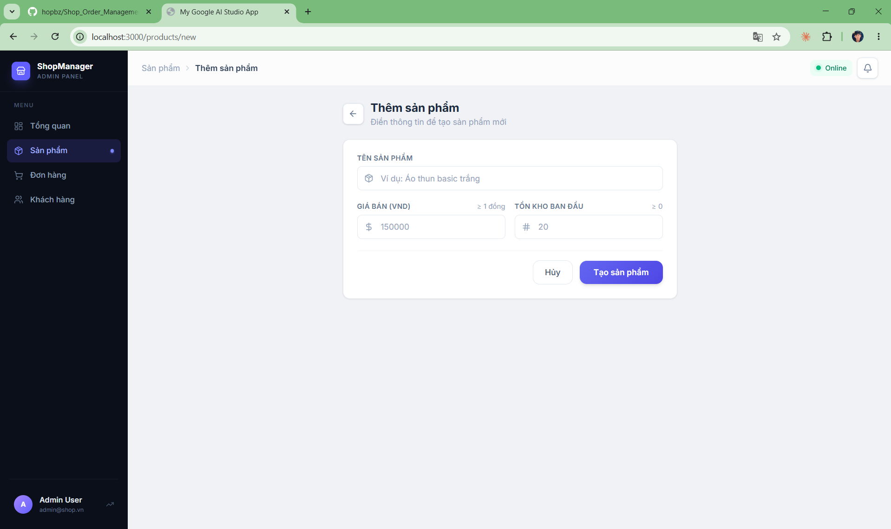
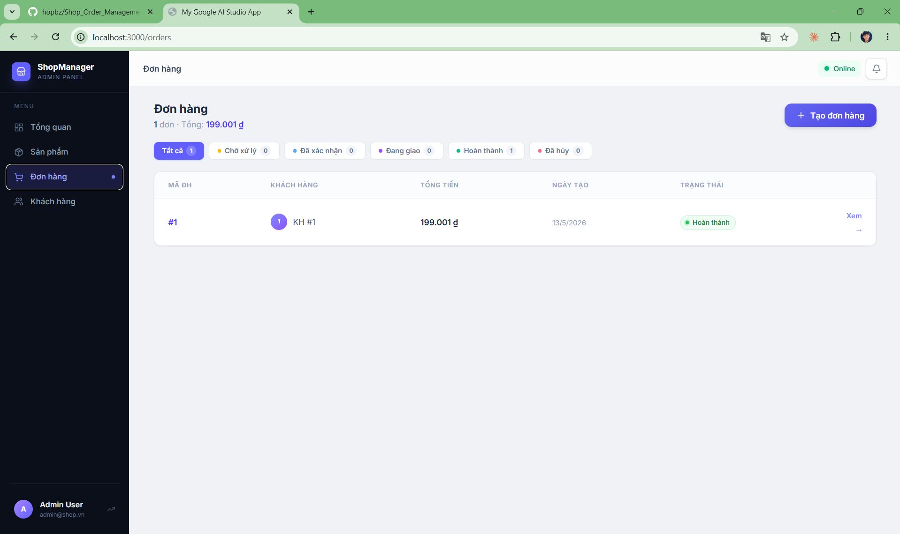
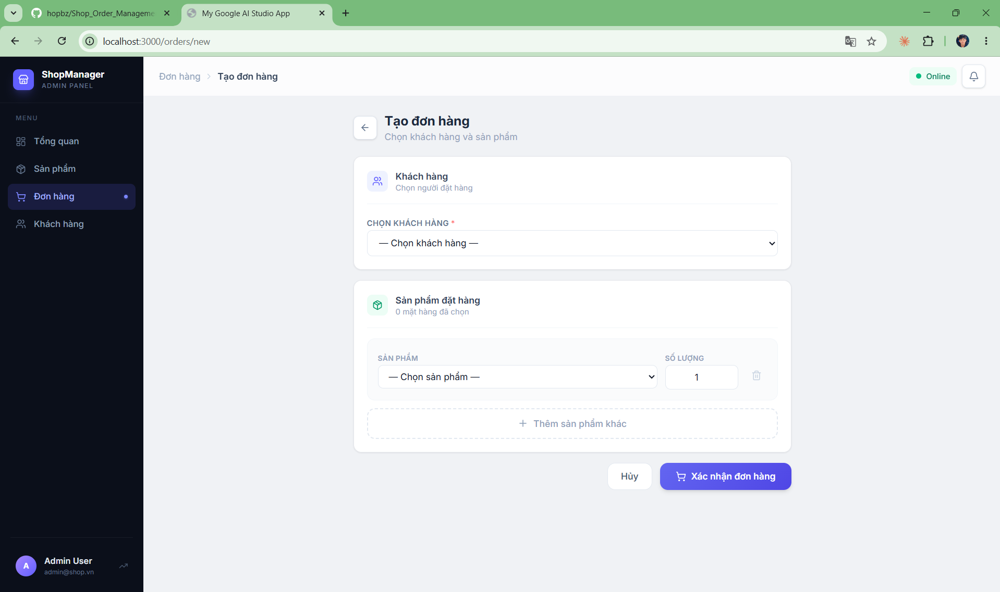
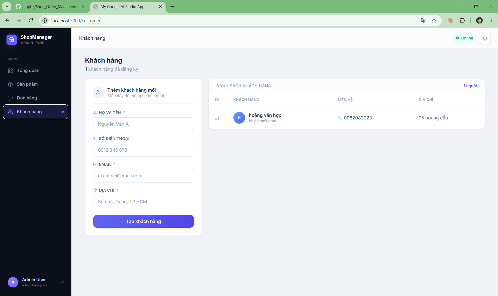

# 🛒 Shop Order Management System

<div align="center">


**Hệ thống quản lý cửa hàng nội bộ** — Backend Spring Boot + Frontend React + MySQL  
Hỗ trợ quản lý sản phẩm, khách hàng và đơn hàng với giao diện web hiện đại.

[🎬 Xem Demo](#-demo) · [📦 Cài đặt nhanh](#-cài-đặt-nhanh-docker) · [📖 API Docs](#-api-reference) · [🐛 Báo lỗi](https://github.com/hopbz/Shop_Order_Management/issues)

</div>

---

## 📋 Mục lục

- [Giới thiệu](#-giới-thiệu)
- [Demo](#-demo)
- [Giao diện](#-giao-diện-screenshots)
- [Công nghệ sử dụng](#-công-nghệ-sử-dụng)
- [Cấu trúc dự án](#-cấu-trúc-dự-án)
- [Database Schema](#-database-schema)
- [Cài đặt nhanh (Docker)](#-cài-đặt-nhanh-docker)
- [Chạy local (không Docker)](#-chạy-local-không-docker)
- [Deploy lên Cloud](#-deploy-lên-cloud-ubuntu-server)
- [API Reference](#-api-reference)
- [Biến môi trường](#-biến-môi-trường)
- [Tác giả](#-tác-giả)

---

## 🌟 Giới thiệu

**Shop Order Management** là ứng dụng quản lý cửa hàng nội bộ full-stack, được xây dựng với mục tiêu học tập và thực hành kiến trúc phần mềm hiện đại.

**Tính năng chính:**
- 📦 Quản lý sản phẩm: thêm, sửa, tìm kiếm, toggle ACTIVE/INACTIVE, xóa mềm
- 👥 Quản lý khách hàng: đăng ký, xem danh sách, tra cứu thông tin
- 🧾 Quản lý đơn hàng: tạo đơn, theo dõi trạng thái, xem chi tiết
- 📊 Dashboard tổng quan: KPI doanh thu, sản phẩm, đơn hàng, khách hàng
- 🐳 Containerized hoàn toàn với Docker Compose
- 🔄 RESTful API với validation đầy đủ

---

## 🎬 Demo

> 🎥 **Video demo đầy đủ:** [Xem trên YouTube](https://youtu.be/FdPx4d-aPf0)

---

## 📸 Giao diện (Screenshots)

### 🏠 Dashboard — Tổng quan

> KPI cards hiển thị doanh thu, số sản phẩm, đơn hàng, khách hàng và danh sách đơn hàng gần đây.

---

### 📦 Quản lý sản phẩm

> Bảng sản phẩm với tìm kiếm theo tên, toggle ACTIVE/INACTIVE, xóa mềm.

---

### ➕ Thêm sản phẩm mới

> Form tạo sản phẩm với validation giá bán và tồn kho ban đầu.

---

### 📋 Quản lý đơn hàng

> Lọc đơn hàng theo trạng thái, xem tổng doanh thu realtime.

---

### 🛍️ Tạo đơn hàng

> Chọn khách hàng, thêm nhiều sản phẩm và số lượng, xác nhận đơn.

---

### 👥 Quản lý khách hàng

> Form thêm khách hàng inline và bảng danh sách với thông tin liên hệ đầy đủ.

---

## 🛠️ Công nghệ sử dụng

| Nhóm | Công nghệ |
|------|-----------|
| **Backend** | Java 17, Spring Boot 3.3, Spring Data JPA, Bean Validation |
| **Database** | MySQL 8 |
| **Frontend** | React 19, TypeScript, Vite 6, Tailwind CSS 4, React Router 7 |
| **Deploy** | Docker, Docker Compose, Nginx |
| **Tools** | Postman (API testing), Git |

---

## 📁 Cấu trúc dự án

```
shop/
├── BE/                          # Spring Boot backend
│   ├── src/main/java/com/example/shop/
│   │   ├── config/              # CorsConfig, JpaAuditingConfig
│   │   ├── controller/          # CustomerController, ProductController, OrderController
│   │   ├── service/             # Business logic
│   │   ├── repository/          # JPA repositories
│   │   ├── entity/              # Customer, Product, Order, OrderItem
│   │   ├── dto/                 # Request / Response DTOs
│   │   └── exception/           # Custom exceptions + GlobalExceptionHandler
│   ├── src/main/resources/
│   │   └── application.properties
│   ├── Dockerfile
│   └── pom.xml
│
├── FE/                          # React frontend
│   ├── src/
│   │   ├── pages/               # Dashboard, ProductsPage, CustomersPage, OrdersPage...
│   │   ├── components/          # Layout, OfflineBanner, EmptyState, UI components
│   │   ├── hooks/               # useToast, useBackendStatus
│   │   ├── services/
│   │   │   └── api.ts           # HTTP client (fetch wrapper + typed API methods)
│   │   └── lib/
│   │       └── utils.ts         # formatCurrency, cn (clsx)
│   ├── .env                     # VITE_API_URL=http://localhost:8080/api
│   ├── nginx.conf               # Nginx config (SPA routing + API proxy)
│   ├── Dockerfile
│   └── vite.config.ts
│
├── docs/
│   └── screenshots/             # Ảnh giao diện
│       ├── bang-dieu-khien.png
│       ├── san-pham.png
│       ├── tao-san-pham.png
│       ├── don-hang.png
│       ├── tao-don-hang.png
│       └── khach-hang.png
├── docker-compose.yml
├── .env
├── Shop_API.postman_collection.json
└── README.md
```

---

## 🗄️ Database Schema

```
customers   id | full_name | phone | email | address | created_at | updated_at
products    id | name | price | stock_quantity | status | deleted | created_at | updated_at
orders      id | customer_id | total_amount | status | created_at | updated_at
order_items id | order_id | product_id | quantity | unit_price | line_total | created_at | updated_at
```

**Luồng trạng thái đơn hàng:**

```
PENDING → CONFIRMED → SHIPPING → COMPLETED
                              ↘ CANCELED
```

---

## 🐳 Cài đặt nhanh (Docker)

### Yêu cầu
- Docker Engine 24+
- Docker Compose v2

### Các bước

```bash
# 1. Clone dự án
git clone https://github.com/hopbz/Shop_Order_Management.git
cd Shop_Order_Management

# 2. Build và chạy (lần đầu ~3-5 phút)
docker compose up --build -d

# 3. Kiểm tra các container
docker compose ps
```

### Truy cập

| Dịch vụ | URL |
|---------|-----|
| 🖥️ Frontend (UI) | http://localhost:3000 |
| ⚙️ Backend API | http://localhost:8080/api |
| ❤️ Health check | http://localhost:8080/api/health |

### Lệnh hữu ích

```bash
# Xem log realtime
docker compose logs -f

# Dừng (giữ data)
docker compose down

# Dừng và xóa DB (reset hoàn toàn)
docker compose down -v
```

---

## 💻 Chạy local (không Docker)

### Yêu cầu
- Java 17+, Maven 3.9+
- MySQL 8 đang chạy
- Node.js 18+

### 1. Tạo database

```sql
CREATE DATABASE IF NOT EXISTS shop_db CHARACTER SET utf8mb4 COLLATE utf8mb4_unicode_ci;
```

### 2. Chạy Backend

```bash
cd BE

# Windows
mvnw.cmd spring-boot:run

# macOS / Linux
./mvnw spring-boot:run
```

> Mặc định kết nối `localhost:3306`, user `root`, password `root`.  
> Sửa trong `BE/src/main/resources/application.properties` hoặc đặt biến môi trường `DB_*`.

✅ Backend sẵn sàng tại: **http://localhost:8080**

### 3. Chạy Frontend

```bash
cd FE
npm install
npm run dev
```

✅ Frontend sẵn sàng tại: **http://localhost:3000**

---

## ☁️ Deploy lên Cloud (Ubuntu Server)

```bash
# 1. Cài Docker
curl -fsSL https://get.docker.com | sh
sudo usermod -aG docker $USER && newgrp docker

# 2. Clone dự án
git clone https://github.com/hopbz/Shop_Order_Management.git shop
cd shop

# 3. (Tuỳ chọn) Đổi mật khẩu DB trong .env
nano .env

# 4. Build và chạy
docker compose up --build -d

# 5. Kiểm tra
docker compose ps
docker compose logs backend
```

> 🌐 Truy cập UI tại: `http://<server-ip>:3000`  
> ⚠️ Để bảo mật hơn, đứng sau reverse proxy (Nginx/Caddy) với HTTPS và domain riêng.

---

## 📖 API Reference

### Health

| Method | Path | Mô tả |
|--------|------|--------|
| `GET` | `/api/health` | Kiểm tra backend hoạt động |

**Response:** `{ "status": "UP" }`

---

### Customers — `/api/customers`

| Method | Path | Mô tả |
|--------|------|--------|
| `POST` | `/api/customers` | Tạo khách hàng mới |
| `GET` | `/api/customers` | Lấy danh sách tất cả |
| `GET` | `/api/customers/{id}` | Chi tiết khách hàng |

<details>
<summary><b>Xem ví dụ Request/Response</b></summary>

**Request tạo khách hàng:**
```json
{
  "fullName": "Nguyễn Văn A",
  "phone": "0912345678",
  "email": "a@example.com",
  "address": "Quận 1, TP.HCM"
}
```

**Response (201):**
```json
{
  "id": 1,
  "fullName": "Nguyễn Văn A",
  "phone": "0912345678",
  "email": "a@example.com",
  "address": "Quận 1, TP.HCM",
  "createdAt": "2025-01-01T10:00:00",
  "updatedAt": "2025-01-01T10:00:00"
}
```
</details>

---

### Products — `/api/products`

| Method | Path | Mô tả |
|--------|------|--------|
| `POST` | `/api/products` | Tạo sản phẩm mới |
| `GET` | `/api/products` | Danh sách (bỏ qua deleted) |
| `GET` | `/api/products?name=áo` | Tìm kiếm theo tên |
| `GET` | `/api/products/{id}` | Chi tiết sản phẩm |
| `PUT` | `/api/products/{id}` | Cập nhật toàn bộ thông tin |
| `PATCH` | `/api/products/{id}/status` | Đổi trạng thái ACTIVE/INACTIVE |
| `DELETE` | `/api/products/{id}` | **Xóa mềm** |

<details>
<summary><b>Xem ví dụ Request/Response</b></summary>

**Request tạo/cập nhật sản phẩm:**
```json
{
  "name": "Áo thun basic",
  "price": 150000,
  "stockQuantity": 20
}
```

**Request đổi trạng thái:**
```json
{ "status": "INACTIVE" }
```

> **INACTIVE vs Xóa mềm:**
> - `INACTIVE` → Ngừng bán, vẫn thấy trong danh sách quản lý
> - Soft delete → Ẩn hoàn toàn khỏi UI, không đặt hàng được, nhưng lịch sử `order_items` vẫn còn

</details>

---

### Orders — `/api/orders`

| Method | Path | Mô tả |
|--------|------|--------|
| `POST` | `/api/orders` | Tạo đơn hàng |
| `GET` | `/api/orders` | Danh sách tất cả |
| `GET` | `/api/orders?status=PENDING` | Lọc theo trạng thái |
| `GET` | `/api/orders/{id}` | Chi tiết + danh sách items |
| `PATCH` | `/api/orders/{id}/status` | Cập nhật trạng thái |

<details>
<summary><b>Xem ví dụ Request/Response</b></summary>

**Request tạo đơn hàng:**
```json
{
  "customerId": 1,
  "items": [
    { "productId": 1, "quantity": 2 },
    { "productId": 3, "quantity": 1 }
  ]
}
```

**Request cập nhật trạng thái:**
```json
{ "status": "CONFIRMED" }
```

**Error Response:**
```json
{
  "status": 400,
  "message": "Validation failed",
  "errors": {
    "phone": "Số điện thoại phải đúng 10 chữ số",
    "email": "Email không đúng định dạng"
  }
}
```
</details>

---

## 🔍 Validation Rules

| Field | Rule |
|-------|------|
| `fullName` | Không được rỗng |
| `phone` | Đúng 10 chữ số (`^[0-9]{10}$`) |
| `email` | Đúng định dạng email |
| `price` | > 0 |
| `stockQuantity` | ≥ 0 |
| `status` (product) | `ACTIVE` hoặc `INACTIVE` |
| `status` (order) | `PENDING` \| `CONFIRMED` \| `SHIPPING` \| `COMPLETED` \| `CANCELED` |
| `quantity` | ≥ 1 và ≤ tồn kho hiện tại |

---

## 🧪 Test Cases gợi ý (Postman)

Import file `Shop_API.postman_collection.json` để chạy nhanh.

| # | Loại | Endpoint | Kỳ vọng |
|---|------|----------|---------|
| 1 | ✅ | `POST /api/customers` (hợp lệ) | 201 + CustomerResponse |
| 2 | ✅ | `POST /api/products` (hợp lệ) | 201 + ProductResponse |
| 3 | ✅ | `POST /api/orders` (2 sản phẩm) | 201, tổng tiền đúng, tồn kho giảm |
| 4 | ✅ | `GET /api/products?name=áo` | 200 + danh sách lọc |
| 5 | ✅ | `PATCH /api/orders/{id}/status` → CONFIRMED | 200 + status mới |
| 6 | ❌ | `POST /api/customers` email sai | 400 + validation error |
| 7 | ❌ | `POST /api/products` price âm | 400 + validation error |
| 8 | ❌ | `POST /api/orders` customerId không tồn tại | 404 |
| 9 | ❌ | `POST /api/orders` quantity > tồn kho | 400 OutOfStock |
| 10 | ❌ | `PATCH /api/orders/{COMPLETED_id}/status` → CANCELED | 400 Invalid |

---

## ⚙️ Biến môi trường

### Root `.env` (Docker Compose)

| Biến | Mặc định | Mô tả |
|------|----------|--------|
| `DB_HOST` | `localhost` | Host MySQL |
| `DB_PORT` | `3306` | Port MySQL |
| `DB_NAME` | `shop_db` | Tên database |
| `DB_USER` | `root` | User MySQL |
| `DB_PASSWORD` | `root` | ⚠️ Đổi trên production |
| `VITE_API_URL` | `/api` | URL API cho frontend Docker build |

### `FE/.env` (Local dev)

| Biến | Giá trị |
|------|---------|
| `VITE_API_URL` | `http://localhost:8080/api` |

---

## 👨‍💻 Tác giả

<table>
  <tr>
    <td align="center">
      <a href="https://github.com/hopbz">
        <br/>
        <sub><b>hopbz</b></sub>
      </a>
    </td>
  </tr>
</table>

---


---

<div align="center">

⭐ Nếu dự án này hữu ích, hãy để lại một **Star** nhé!

</div>